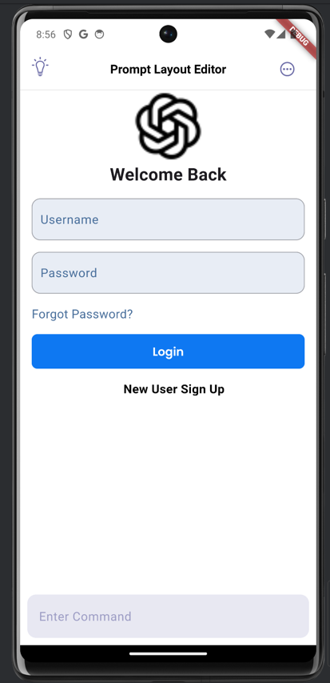
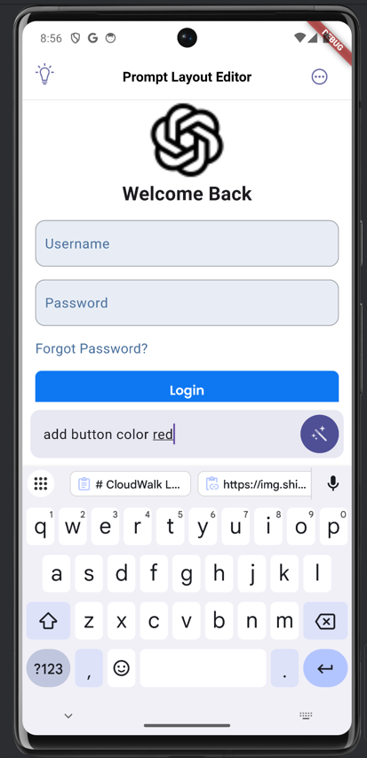
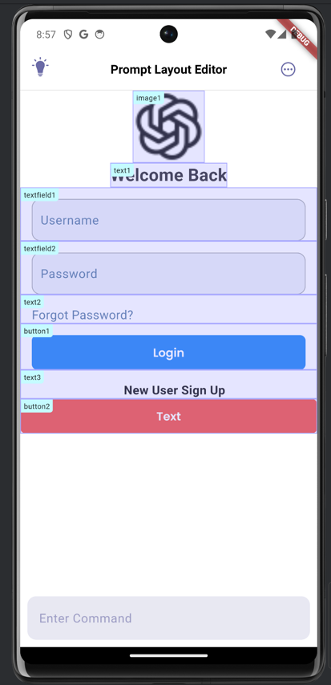

# NLP Flutter UI Builder 🧠

> Natural Language to Flutter UI: Build interfaces with conversational commands





## 🚀 Overview

NLP Flutter UI Builder is a Flutter application that transforms natural language into live Flutter UI components. Using advanced NLP processing, you can create, modify, and manage UI elements through simple conversational commands.

**Talk to your UI:**
```
"Add a red button with text 'Submit'"
"Change the background to blue"  
"Remove text widget number 1"
```

## 🤖 LLM API Support
This project supports prompt-based layout editing using an LLM API.

**Model in use: gemma2-9b-it**

Purpose: Transform natural language commands into Flutter UI structures

Example Prompts:

add button with text 'Submit'

change background to white

remove text1

The LLM API enables dynamic and intuitive UI creation by interpreting conversational input.